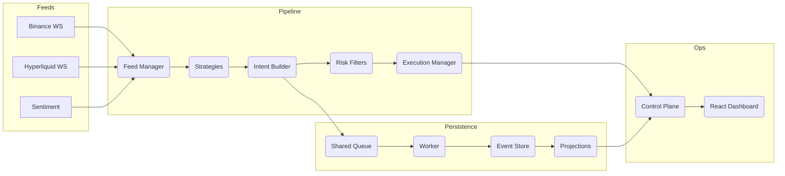

# rx-trader

Reactive, event‑sourced crypto trading system in Bun + TypeScript. One process ingests live ticks, builds signals, shapes intents through risk and execution policy, persists every event, and serves a control‑plane API plus a live dashboard. The same runtime powers deterministic backtests by swapping dependencies (feeds, execution, clocks, persistence).

--

## Core Philosophy
- Event‑first: every tick, signal, intent, fill, snapshot, and analytic is an immutable event. Projections and dashboards are pure replays over the same facts.
- Reactive by design: RxJS wires feeds → strategies → intent builder → risk → execution. Business logic stays pure; side effects live at the edges.
- Config‑first: the same binary runs demos, backtests, and live trading. Behavior is driven by `rx.config.json` and env vars.
- Single runtime: no microservice sprawl. A persistence worker offloads DB writes without touching the hot path.

--

## Architecture


--

## Packages
- `packages/core` – Domain schemas (Zod) and constants for ticks, orders, events, portfolio, time.
- `packages/feeds` – Live WebSocket adapters (Binance, Hyperliquid) and a sentiment/demo feed.
- `packages/strategies` – Strategy registry and DSL (rolling windows, z‑scores, crossovers, cooldown/dedupe helpers, intent builder).
- `packages/risk` – Pre‑trade and post‑trade risk modules.
- `packages/execution` – Paper adapter plus REST gateways (Binance, Hyperliquid) with retries and circuit breakers.
- `packages/event-store` – Memory/SQLite stores, projections (positions, PnL), snapshot/replay, shared‑memory queue + worker.
- `packages/portfolio` – Positions/PnL analytics, balance sync providers, and the automated rebalancer service.
- `packages/pipeline` – Feed manager, strategy orchestrator, execution policy/manager, intent reconciliation, feed health metrics.
- `packages/control-plane` – Composition entrypoint (`startEngine`) + Bun HTTP/SSE API (status, positions, PnL, orders, artifacts, logs, metrics).
- `packages/dashboard` – Vite + React + shadcn/ui dashboard (dev server for local; can be served by the control plane in prod).

--

## Quickstart (5–10 minutes)

- Prereqs: Bun ≥ 1.3, Node ≥ 20, SQLite.

1) Install deps and the CLI shim
```
bun install
bun run link:rx   # installs an 'rx' shim into ~/.bun/bin
```

2) Guided setup
```
rx setup          # copies rx.config.json (if missing), syncs market-structure, seeds a demo tick
rx config print   # show effective config + source of each value
rx market:sync    # re-sync Binance + Hyperliquid exchange info into SQLite (idempotent)
```

3) Start (paper mode) with the dashboard
```
rx run --dashboard
# Control plane: http://localhost:8080
# Dashboard (dev): http://localhost:5173
```

4) Go live (optional)
```
BINANCE_API_KEY=... BINANCE_API_SECRET=... \
HYPERLIQUID_API_KEY=... HYPERLIQUID_API_SECRET=... \
rx run --live --dashboard
```
If a venue lacks credentials, a mock adapter is used for that venue while everything else stays live.

--

## Backtests and Benchmarks
- Backtest over CSV/Parquet/JSON (auto‑detected via DuckDB) and publish artifacts:
```
rx backtest --data BTCUSDT-1m-2025-10.csv --symbol BTCUSDT --publish http://localhost:8080
```
- Inspect datasets quickly:
```
bun run scripts/inspectTicks.ts BTCUSDT-1m-2025-10.csv
```
- Benchmark the pipeline:
```
rx bench --ticks 100000 --symbol BTCUSDT --store sqlite --sqlite bench.sqlite
```

--

## Configuration
Three layers (later overrides earlier):
1. `rx.config.json` (or `RX_CONFIG_PATH`)
2. Environment variables (`.env` is loaded automatically)
3. Inline overrides (`KEY=value rx run ...`)

Example `rx.config.json`:
```json
{
  "strategy_type": "PAIR",
  "strategy_trade_symbol": "BTCUSDT",
  "strategy_primary_feed": "BINANCE",
  "risk_max_position": 1,
  "risk_notional_limit": 1000000,
  "intent_mode": "market",
  "sqlite_path": "rxtrader.sqlite",
  "market_structure_sqlite_path": "market-structure.sqlite",
  "rebalancer_targets": [
    { "venue": "binance", "asset": "USDT", "min": 100 }
  ]
}
```
Print the effective configuration:
```
rx config print --json
```

--

## Control‑Plane API (selected)
- `GET /status` – runtime status (mode, strategy, feed health, PnL summary)
- `GET /positions`, `GET /pnl` – projections
- `POST /orders` – enqueue a paper order; `POST /orders/:venue` – submit to a specific venue
- `GET /events` / `GET /logs` – SSE streams for events and logs
- `POST /backtest/artifacts` / `GET /backtest/artifacts/history` – publish and browse backtest results

--

## Develop & Test
```
bun x tsc --noEmit           # typecheck
bun x eslint .               # lint
bun test                     # unit + integration suites
RUN_REAL_FEED_TESTS=true bun test packages/feeds/src/binance.real.test.ts
bun x knip --no-config-hints # dead-code analysis (dashboard allowlisted)
```

--

## Extend
- New feed: implement a `WebSocketFeed` adapter and register in the enum; add a real‑WS test.
- New strategy: add an observable from ticks to `StrategySignal`, export in the registry; wire intent builder params via config.
- New risk: extend `packages/risk` pre/post trade modules and their tests.
- New venue: implement `ExecutionAdapter` with retries/circuit breakers; wire in the control plane.
- New store: implement the `EventStore` interface and add it to the factory + projections’ tests.

--

## Notes
- Dashboard fetch errors (CORS): ensure the `GATEWAY_PORT` matches the control‑plane log; dev uses permissive CORS.
- SQLite “database is locked”: the persistence worker backs off; increase `PERSIST_QUEUE_CAPACITY` or adjust busy timeout if needed.
- Without creds: venues default to mock execution while still using real feeds.
