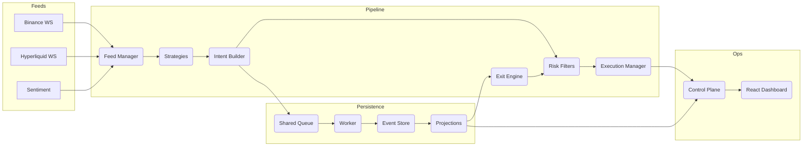

# rx-trader

A thought experiment: what happens when you model an entire crypto trading system as reactive streams?

rx-trader is an event-sourced, RxJS-powered trading engine built in Bun + TypeScript. The core idea is that every stage of the trading pipeline, from tick ingestion to order execution, is an observable composition. Business logic stays pure; side effects live at the edges. One process, one event loop, zero microservice sprawl.

---

## The Experiment

The hypothesis: reactive streams are a natural fit for trading systems. Ticks are streams. Signals are derived streams. Risk filters are operators. Execution is a subscriber. If the abstraction holds, the same code should run backtests, paper trading, and live trading by swapping dependencies at the edges.

```
feeds.ticks$
  -> strategies.signals$
  -> intentBuilder(signals$, marks$)
  -> riskFilter.check(intents$)
  -> execution.submit(approved$)
  -> execution.fills$
  -> portfolio.snapshots$
```

Everything is an event. Every event is persisted. Every view is a replay.

---

## Architecture



### Hot Path vs Cold Path

The system splits into two data planes:

**Hot path (RxJS observables)** handles the trading-critical flow. Ticks stream through strategies, intent shaping, risk filters, and execution as direct observable chains. Sub-millisecond latency, compile-time type safety, backpressure control via operators like `throttle`, `buffer`, and `sample`.

**Cold path (EventBus)** handles observability. Every significant state transition (signals, risk decisions, fills, portfolio snapshots) is emitted as a domain event for persistence, dashboard updates, and the audit trail. Heavy I/O stays off the hot path entirely.

---

## Packages

| Package | Purpose |
|---------|---------|
| `core` | Domain types (Zod schemas), event definitions, time abstractions |
| `feeds` | WebSocket adapters (Binance, Hyperliquid), sentiment feed |
| `strategies` | Strategy registry, DSL operators (rolling stats, z-scores, crossovers, cooldowns) |
| `risk` | Pre-trade and post-trade risk modules |
| `execution` | Paper adapter, REST venue gateways, retry/circuit breaker policy |
| `pipeline` | Feed manager, strategy orchestrator, execution manager, intent reconciliation |
| `portfolio` | Position/PnL analytics, balance sync, accounting |
| `event-store` | Append-only stores (memory/SQLite), projections, shared-memory queue + worker |
| `market-structure` | Exchange metadata, symbol normalization, fee schedules |
| `control-plane` | Runtime composition, HTTP/SSE API, dashboard serving |
| `dashboard` | React + shadcn/ui live dashboard |
| `config` | Layered config resolution (file -> env -> inline overrides) |
| `observability` | Structured logging, Prometheus metrics |

---

## Quickstart

Prerequisites: Bun >= 1.3, Node >= 20, SQLite.

```bash
bun install
bun run link:rx       # install the 'rx' CLI shim

rx setup              # generate config, sync market structure
rx run --dashboard    # start in paper mode with dashboard
```

Control plane at `http://localhost:8080`, dashboard at `http://localhost:5173`.

### Demo Mode

```bash
rx env:demo --dashboard
```

Seeds SQLite, boots multi-strategy paper trading (BTC momentum + cross-venue arbitrage), and launches the dashboard with live Strategy Mixer.

### Backtesting

```bash
rx backtest --data BTCUSDT-1m-2025-10.csv --symbol BTCUSDT --publish http://localhost:8080
```

Backtests use the exact same event pipeline. Intents, orders, and fills are persisted and inspectable through the dashboard.

---

## Configuration

Three layers (later overrides earlier):
1. `rx.config.json` (or `RX_CONFIG_PATH`)
2. Environment variables (`.env` loaded automatically)
3. Inline overrides (`KEY=value rx run ...`)

```bash
rx config print --json   # show effective config
```

Strategies, risk limits, exit rules, venue preferences, and margin settings are all config-driven. See `rx.config.example.json` for the full schema.

---

## Key Design Decisions

- **Single process**: no microservice overhead. A persistence worker offloads DB writes without touching the event loop.
- **Event sourcing**: every tick, signal, intent, fill, and snapshot is an immutable event. Projections and dashboards are pure replays.
- **Config-first**: the same binary runs demos, backtests, and live trading. Behavior is driven entirely by configuration.
- **Shared-memory persistence**: a `SharedArrayBuffer` ring buffer sits between the pipeline and the persistence worker. The hot path never blocks on DB writes.
- **Multi-strategy**: strategies run as isolated observable graphs with per-strategy budgets, priorities, and sandbox/live modes.

---

## Development

```bash
bun x tsc --noEmit     # typecheck
bun x eslint .         # lint
bun test               # unit + integration
rx bench               # pipeline latency benchmark
```

---

## Status

This is an active experiment. The architecture is stable and the core pipeline works end-to-end (feeds -> strategies -> risk -> execution -> persistence -> dashboard). See the issues for current work.
