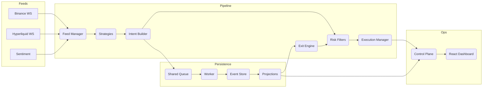

# rx-trader

Reactive, event‑sourced crypto trading system in Bun + TypeScript. One process ingests live ticks, builds signals, shapes intents through risk and execution policy, persists every event, and serves a control‑plane API plus a live dashboard. The same runtime powers deterministic backtests by swapping dependencies (feeds, execution, clocks, persistence).

--

## Core Philosophy
- Event‑first: every tick, signal, intent, fill, snapshot, and analytic is an immutable event. Projections and dashboards are pure replays over the same facts.
- Reactive by design: RxJS wires feeds → strategies → intent builder → risk → execution. Business logic stays pure; side effects live at the edges.
- Config‑first: the same binary runs demos, backtests, and live trading. Behavior is driven by `rx.config.json` and env vars.
- Single runtime: no microservice sprawl. A persistence worker offloads DB writes without touching the hot path.

--

## Architecture


--

## Tick-to-Trade Path
1. **Tick ingestion & normalization** – `FeedManager` fans in Binance, Hyperliquid, sentiment, and historical/backtest feeds. Every raw payload is parsed, symbol IDs are normalized via the market‑structure package, and redundant ticks are eliminated (sequence+timestamp guards) before hitting the hot observable.
2. **Signal + fair value generation** – Strategies subscribe to the normalized tick stream (plus optional secondary feeds) and compose DSL operators such as `priceSeries`, `sma`, `rollingZScore`, `pairSpread`, and `cooldown`. The result is a deterministic stream of `StrategySignal` objects describing desired exposure deltas plus telemetry (alpha, confidence, diagnostics).
3. **Exit engine overlay** – Positions, PnL, microstructure, and risk projections replayed from the event store feed into the `ExitEngine`. Time stops, TP/SL sigma bands, trailing stops, fair‑value reversion, and portfolio overrides emit `exitIntent` events that share the same downstream path as entry intents.
4. **Intent shaping & risk** – `IntentBuilder` turns signals/exits into trade intents (side, quantity, edge) and tags them with references (strategy ID, feed timestamp, analytics). Pre‑trade risk modules clamp positions, enforce notional caps, per‑venue throttles, leverage budgets, and configurable margin constraints. Rejected intents turn into structured events (reason codes like `throttle`, `margin`, `maxPosition`).
5. **Execution** – The execution manager merges approved intents with per‑venue fee curves, maker/taker preference, and mode (live vs. dry run). It publishes serialized orders to venue adapters (REST/WS for Binance/Hyperliquid) or the paper adapter. Acks/fills are observed immediately; retries/backoffs live inside each adapter with jittered reconnects so the pipeline never blocks.
6. **Feedback loop** – Orders, fills, rejects, and balance delta events feed portfolio/risk projections, the dashboard, CLI telemetry (`rx status`), and alerting sinks. Benchmarks (`rx bench`) wrap the entire loop—JSON parse → signal → intent → risk → execution serialize → (mock) venue ack—to measure tick‑to‑trade latency distributions while optionally forcing persistence flushes.

The entire flow runs in one Bun process; observables keep the codepath hot, while dedicated workers handle I/O that would otherwise stall the event loop.

--

## Persistence & Replay
- **Shared-memory queue** – The runtime never blocks on database writes. Every intent/order/fill/log gets appended to a `SharedArrayBuffer` ring buffer. When it nears capacity the pipeline emits a warning and (optionally) falls back to inline writes.
- **Persistence worker** – `scripts/persistence-worker.ts` drains the queue in its own Bun Worker, batches events, and writes them through the selected driver (default SQLite via `rxtrader.sqlite`; memory for tests; Postgres remains available for legacy runs). Because the worker runs outside the main thread, DB fsyncs and migrations no longer inflate tick‑to‑trade latency.
- **Event store** – `packages/event-store` defines the append/read API, stream categories (`tick`, `signal`, `intent`, `order`, `fill`, `snapshot`, `analytics`), migrations (Drizzle), and projection helpers. Append latency, queue depth, and worker health are exposed via the `/metrics` endpoint for Prometheus/Grafana.
- **Projections & snapshots** – `buildProjection` describes how to fold events into portfolio, PnL, trade journal, and balance views. Snapshots are emitted periodically and on clean shutdown; replay on startup hydrates the latest state before the first tick arrives. CLI commands (`rx snapshot:positions`, `rx recover:positions`, `rx replay`) reuse the same code paths for maintenance and DR.
- **Backtests & demos** – Historical runs use the exact event flow: when `rx backtest` replays a dataset, it still produces intents/orders/fills that append to the store and can be inspected via the dashboard or CLI. The `env:demo` command seeds SQLite, spawns the persistence worker, and makes the dashboard consume projections built off the stored events—no hidden mocks.
- **Control-plane & UI** – `/positions`, `/pnl`, `/trades`, `/events`, and the SSE feeds simply read projections or tail the append log. Because every view is a replay, any drift between metrics (dashboard vs. CLI vs. logs) signals a real data issue, not divergent code paths.

Persistence is therefore part of the production contract: if an event hits risk/execution, it is durably recorded, replayable, and visible through the control plane.

--

## Packages
- `packages/core` – Domain schemas (Zod) and constants for ticks, orders, events, portfolio, time.
- `packages/feeds` – Live WebSocket adapters (Binance, Hyperliquid) and a sentiment/demo feed.
- `packages/strategies` – Strategy registry and DSL (rolling windows, z‑scores, crossovers, cooldown/dedupe helpers, intent builder).
- `packages/risk` – Pre‑trade and post‑trade risk modules.
- `packages/execution` – Paper adapter plus REST gateways (Binance, Hyperliquid) with retries and circuit breakers.
- `packages/event-store` – Memory/SQLite stores, projections (positions, PnL), snapshot/replay, shared‑memory queue + worker.
- `packages/portfolio` – Positions/PnL analytics, balance sync providers, and the automated rebalancer service.
- `packages/pipeline` – Feed manager, strategy orchestrator, execution policy/manager, intent reconciliation, feed health metrics.
- `packages/control-plane` – Composition entrypoint (`startEngine`) + Bun HTTP/SSE API (status, positions, PnL, orders, artifacts, logs, metrics).
- `packages/dashboard` – Vite + React + shadcn/ui dashboard (dev server for local; can be served by the control plane in prod).

--

## Quickstart (5–10 minutes)

- Prereqs: Bun ≥ 1.3, Node ≥ 20, SQLite.

1) Install deps and the CLI shim
```
bun install
bun run link:rx   # installs an 'rx' shim into ~/.bun/bin
```

2) Guided setup
```
rx setup          # copies rx.config.json (if missing), syncs market-structure, seeds a demo tick
rx config print   # show effective config + source of each value
rx market:sync    # re-sync Binance + Hyperliquid exchange info into SQLite (idempotent)
```

3) Start (paper mode) with the dashboard
```
rx run --dashboard
# Control plane: http://localhost:8080
# Dashboard (dev): http://localhost:5173
```

4) Go live (optional)
```
BINANCE_API_KEY=... BINANCE_API_SECRET=... \
HYPERLIQUID_API_KEY=... HYPERLIQUID_API_SECRET=... \
rx run --live --dashboard
```
If a venue lacks credentials, a mock adapter is used for that venue while everything else stays live.

### Demo (multi-strategy)
`rx env:demo --dashboard` seeds SQLite, hydrates `STRATEGIES` with the BTC momentum + Binance/Hyperliquid arbitrage pair, bootstraps the trader, launches the dashboard dev server, and wires the mock balance provider. The new **Strategy Mixer** in the dashboard lets you switch between strategies (or view “All”), filter positions/orders, and watch aggregated signals/intents/orders/fills/rejects plus last-activity timestamps per strategy.

--

## Backtests and Benchmarks
- Backtest over CSV/Parquet/JSON (auto‑detected via DuckDB) and publish artifacts:
```
rx backtest --data BTCUSDT-1m-2025-10.csv --symbol BTCUSDT --publish http://localhost:8080
```
- Inspect datasets quickly:
```
bun run scripts/inspectTicks.ts BTCUSDT-1m-2025-10.csv
```
- Benchmark the pipeline:
```
rx bench --ticks 100000 --symbol BTCUSDT --store sqlite --sqlite bench.sqlite
```

--

## Configuration
Three layers (later overrides earlier):
1. `rx.config.json` (or `RX_CONFIG_PATH`)
2. Environment variables (`.env` is loaded automatically)
3. Inline overrides (`KEY=value rx run ...`)

Example `rx.config.json`:
```json
{
  "strategies": [
    {
      "id": "btc-momo",
      "type": "MOMENTUM",
      "tradeSymbol": "BTCUSDT",
      "primaryFeed": "BINANCE",
      "params": { "fastWindow": 5, "slowWindow": 20 },
      "exit": { "enabled": false }
    }
  ],
  "risk_max_position": 1,
  "risk_notional_limit": 1000000,
  "intent_mode": "market",
  "sqlite_path": "rxtrader.sqlite",
  "market_structure_sqlite_path": "market-structure.sqlite",
  "rebalancer_targets": [
    { "venue": "binance", "asset": "USDT", "min": 100 }
  ]
}
```
Print the effective configuration:
```
rx config print --json
```

### Multiple strategies
Set the `strategies` array (or `STRATEGIES` env var containing JSON) to register multiple strategy definitions with priorities, sandbox mode, and optional per-strategy budgets.

```json
{
  "strategies": [
    {
      "id": "btc-momo",
      "type": "MOMENTUM",
      "tradeSymbol": "BTCUSDT",
      "primaryFeed": "BINANCE",
      "params": { "fastWindow": 5, "slowWindow": 20 },
      "exit": { "enabled": true, "time": { "enabled": true, "maxHoldMs": 300000 } },
      "priority": 10,
      "mode": "live",
      "budget": {
        "notional": 250000,
        "maxPosition": 2,
        "throttle": { "windowMs": 1000, "maxCount": 2 }
      }
    },
    {
      "id": "eth-btc-pair",
      "type": "PAIR",
      "tradeSymbol": "ETHUSDT",
      "primaryFeed": "BINANCE",
      "extraFeeds": ["HYPERLIQUID"],
      "exit": { "enabled": false },
      "mode": "sandbox",
      "priority": 5
    }
  ]
}
```
Any missing budget fields inherit the global `risk_*` limits, and sandboxed strategies emit signals/metrics without submitting intents.

Each strategy publishes telemetry (signals, intents, orders, fills, rejects, last-activity timestamps) that surfaces via `GET /status` (`runtime.strategies[]`) and powers the dashboard Strategy Mixer + CLI/ops tooling.

### Strategy exit rules
Give every strategy an `exit` block to describe when positions should be flattened. The schema supports TP/SL bands (in sigma units), fair-value epsilon checks, time stops, trailing stops, and portfolio overrides (gross/symbol exposure, drawdown, margin buffers). Runtime config validation lives in `exitConfigSchema`, so missing/invalid fields fail fast, and defaults (`tpSigma=1.5`, `slSigma=1`, `epsilonBps=5`, etc.) are injected automatically.

> **Required:** Each strategy entry in the `strategies` array must include an `exit` object. Set `{ "enabled": false }` if you want to keep exits disabled, otherwise specify the rules you need.

```json
"exit": {
  "enabled": true,
  "tpSl": { "enabled": true, "tpSigma": 1.8, "slSigma": 0.9 },
  "fairValue": { "enabled": true, "epsilonBps": 6, "closeOnSignalFlip": true },
  "time": { "enabled": true, "maxHoldMs": 600000, "minHoldMs": 15000 },
  "trailing": { "enabled": true, "retracePct": 0.05, "initArmPnLs": 0.5 },
  "riskOverrides": {
    "maxGrossExposureUsd": 750000,
    "maxSymbolExposureUsd": 250000,
    "maxDrawdownPct": 0.04,
    "marginBufferPct": 0.15,
    "action": "FLATTEN_ALL"
  }
}
```

Exit intents merge back into the same risk/execution pipeline as normal intents, so throttle/price-band/notional guards still apply. Telemetry now tracks exit counts per reason (`EXIT_TP`, `EXIT_TIME`, etc.) and surfaces them via `/status` and the dashboard strategy cards.

### Venue fee sync
- `rx market:sync --exchanges binance,hyperliquid` now brings down both market metadata *and* the current fee schedule for each venue (under the hood it calls `rx fees:sync` so you get a single “make me trading-ready” command).
- `rx fees:sync --venue binance --product SPOT` pulls the latest maker/taker bps from Binance (requires API key/secret) and stores them in `market-structure.sqlite`.
- `rx fees:sync --venue hyperliquid --product PERP` captures Hyperliquid fees (uses public metadata).  
At runtime the execution policy automatically uses the stored fees per venue/symbol and only falls back to the `INTENT_*` defaults when no entry exists (with a warning in the logs).
- Pre-trade risk budgets/account guards now incorporate those maker/taker fees (and reference prices from intent metadata) before approving orders, execution adapters annotate fills with the computed fee + liquidity, and the dashboard Strategy cards display the active tier/source so operators can confirm which schedule is live.

--

## Control‑Plane API (selected)
- `GET /status` – runtime status (live/paper, kill switch, feed health, PnL summary, **`runtime.strategies[]` telemetry for every configured strategy**)
- `GET /positions`, `GET /pnl` – projections
- `POST /orders` – enqueue a paper order; `POST /orders/:venue` – submit to a specific venue
- `GET /events` / `GET /logs` – SSE streams for events and logs
- `POST /backtest/artifacts` / `GET /backtest/artifacts/history` – publish and browse backtest results

--

## Develop & Test
```
bun x tsc --noEmit           # typecheck
bun x eslint .               # lint
bun test                     # unit + integration suites (real feed tests run by default; set RUN_REAL_FEED_TESTS=false to skip)
bun test packages/feeds/src/binance.real.test.ts # run just the Binance real feed test
bun x knip --no-config-hints # dead-code analysis (dashboard allowlisted)
```

--

## Extend
- New feed: implement a `WebSocketFeed` adapter and register in the enum; add a real‑WS test.
- New strategy: add an observable from ticks to `StrategySignal`, export in the registry; wire intent builder params via config.
- New risk: extend `packages/risk` pre/post trade modules and their tests.
- New venue: implement `ExecutionAdapter` with retries/circuit breakers; wire in the control plane.
- New store: implement the `EventStore` interface and add it to the factory + projections’ tests.

--

## Notes
- Dashboard fetch errors (CORS): ensure the `GATEWAY_PORT` matches the control‑plane log; dev uses permissive CORS.
- SQLite “database is locked”: the persistence worker backs off; increase `PERSIST_QUEUE_CAPACITY` or adjust busy timeout if needed.
- Without creds: venues default to mock execution while still using real feeds.
- `rx env:demo --dashboard` is the fastest path to see multi-strategy orchestration end-to-end (paper trading + dashboard Strategy Mixer); stop everything with `Ctrl+C`.
